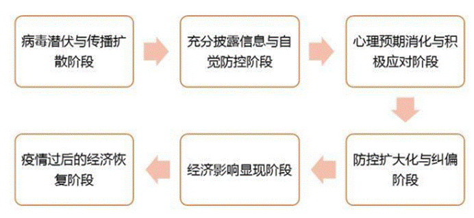

<style type="text/css">

h1 { /* Header 1 */
 font-size: 20px;
 color: DarkBlue;
}
h2 { /* Header 2 */
 font-size: 40px;
 color: DarkBlue;
}
h3 { /* Header 3 */
 font-size: 34px;
 color: DarkBlue;
}
h4 { /* Header 4 */
 font-size: 28px;
 color: DarkBlue;
}
</style>

## **展示内容**

### **1.研究内容**

### **2.研究方法理论介绍**

### **3.ARIMA模型的R实现**

### **4.GM（1,1）模型的R实现**

# 1 研究内容

## 1.1研究背景

&emsp;&emsp;自2019年末湖北武汉首次通报新冠肺炎疫情以来，疫情已经波及中国及海外地区，世界卫生组织宣布新冠肺炎为全球性流行病。新冠肺炎疫情发生以来，习近平总书记始终亲自指挥、亲自部署疫情防控。习近平总书记强调“疫情已经对宏观经济运行产生影响，且对经济运行的影响还会持续”。
<br/>
&emsp;&emsp;疫情发展和影响可分为以下六个阶段：
<div align=center>

</div>

----

<br/>
&emsp;&emsp;当前我们正处于防控扩大化与纠偏阶段，并且疫情的经济影响也逐渐显现出来。新冠肺炎通过对社会及其正常运行体系的冲击使得实体经济停摆，产生直接、全面的经济影响，包括因防控隔离措施导致的居民消费需求大幅下降，因停工停产导致的供给受到极大冲击，金融市场也处于高度紧张和动荡状态等，国际上疫情的全球蔓延也对中国外贸产生了一定的影响。基于此，我们希望可以量化出疫情对经济的影响程度。


## 1.2研究主题
<br/>
&emsp;&emsp;2019年年底至2020年年初，新冠疫情在湖北省发生并向全国迅速蔓延，中国政府迅速采取一系列有力措施阻止疫情蔓延。截至目前，在中央有力领导下疫情得到阶段性控制，但对经济增长的影响不容忽视。居民消费可以直接反映人民生活状况，疫情的全球化蔓延也影响着我国对外贸易，因此本次研究主要是选择我国居民消费指数和进出口两个角度研究疫情对我国经济发展所产生的影响，并结合相关政策进行相应分析。


## 1.3研究思路与方法

**研究方法**&emsp;ARIMA模型，灰色系统GM（1,1）模型，聚类分析

**研究思路**

&emsp;&emsp;1.预测分析。本次研究采用2016年1月-2019年12月我国居民消费指数的月度同比数据和进出口总额月度数据，分别建立ARIMA模型和灰色系统GM（1,1）模型，对比选择预测效果更好的模型对2020年1、2月份进行预测，并与实际数值进行对比分析，量化分析疫情带来的经济影响。

&emsp;&emsp;2.聚类分析。本次研究首先采用2020年2月我国31个省市自治区直辖市的八大类商品居民消费价格指数为研究对象进行聚类分析；其次，将聚类结果同各地区的疫情情况进行综合分析并提出建议。

## 1.4数据来源

研究中的数据来自:
<br/>
&emsp;&emsp;[国家统计局]
http://data.stats.gov.cn/easyquery.htm?cn=A01 
<br/>
&emsp;&emsp;[EPS全球统计数据平台]
&emsp;&emsp;http://olap.epsnet.com.cn/auth/platform.html?sid=7EA90C38B948635819ECE8AE10159CDB_ipv412427683


# 2 理论

## 2.1 ARIMA 模型

### 2.1.1 ARMA 模型

&emsp;&emsp;ARMA模型称为自回归移动平均模型，是时间序列里常用的模型之一。ARMA模型是对不含季节变动的平稳序列进行建模。它将序列值表示为过去值和过去扰动项的加权和。

&emsp;&emsp;模型形式如下:$$ x_t = \mu+ \sum_{i=1}^{p}\gamma_ix_{t-i}+\epsilon _t+\sum_{i=1}^{q}\theta _i\epsilon _{t-i}$$

&emsp;&emsp;其中$x_t$为序列值,$\epsilon _t$为扰动项.

----

### 2.1.2 ARIMA 模型

&emsp;&emsp;ARIMA模型的本质和ARMA是一样的，将ARMA模型里的序列值 $x_t$换成一阶差分的值即可。

#### 模型结构

&emsp;&emsp;若序列$\left \{ \left. x_t \right \} \right.$可以通过d阶差分转化为平稳时间序列,即$\left \{ \left. y_t \right \} \right.=\left\{\left.\Delta^{d}x_t\right\}\right.$是一个平稳时间序列，且可以拟合一个平稳可逆$ARMA(p,q)$模型,则意味着序列$\left \{ \left. x_t \right\}\right.$可以拟合如下形式的模型：
$$\Phi (B)\Delta ^{d}x_t= \Theta (B)\epsilon_t $$
&emsp;&emsp;其中,$\left \{ \left. \epsilon_t \right \} \right.$是一个白噪声序列

----

$$\Phi(B)=1-\sum_{i=1}^{p}\varphi _iB^{i}$$
$$ \Theta (B)=1-\sum_{i=1}^{q}\theta _iB^{i}$$
&emsp;&emsp;上述两个算子多项式的根均在单位圆外。

&emsp;&emsp;具有上述结构的模型称为求和自回归移动平均模型,记为$ARIMA(p,d,q)$.这里，d 指差分的阶数，p 指的是差分序列拟合的 ARMA 模型的自回归的阶数，q指的是差分序列拟合的 ARMA 模型的移动平均的阶数。

----

#### 模型性质

&emsp;&emsp;若${x_t}$服从$ARIMA(p,d,q)$ 模型:$$ \Phi (B)(1-B)^{d} x_t = \Theta (B)\epsilon_t $$
&emsp;&emsp;记$\varphi (B)=\Phi (B)(1-B)^{d}$ , 称$\varphi (B)$为广义自回归算子，$ARIMA(p,d,q)$ 模型的平稳性是由广义自回归算子方程的根决定的,即由下列算子方程：$$\Phi(B)(1-B)^{d}=0$$的根决定。该算子方程共有p+d 个根，其中 p 个在单位圆外，d 个在单位圆上。

----

**1平稳性**

&emsp;&emsp;(1) 当 $d=0$ 时，$ARIMA(p,d,q)$模型是平稳的。模型的可逆性只与模型移动平均部分的算子方程的根有关，只要算子方程 $\Phi (B)=0$ 的根在单位圆外，模型就是可逆的。

&emsp;&emsp;(2) 当 $d \neq 0$时，算子方程有单位根，原序列非平稳。

**2方差齐性**

&emsp;&emsp;(1) 当 $d=0$ 时，$ARIMA(p,d,q)$ 模型是平稳。所以序列方差具有齐性。

&emsp;&emsp;(2) 当 $d \neq0$时，原序列非平稳。方差是非齐性的，d阶差分后序列为平稳序列，差分后序列具有方差齐性。

----

#### 模型建模步骤
<div align=center>

</div>

----

**选择ARIMA模型的方法**


| acf值 |pacf值|模型| 
|:-:|:-:|:-:|
| 拖尾（逐渐减为0） | P阶截尾（p阶快速减为0）|ARIMA(p,d,0)| 
| q阶截尾 | 拖尾 |ARIMA(0,d,q) | 
| 拖尾 | 拖尾 |ARIMA(p,d,q)|


## 2.2灰色GM(1,1)模型

### 2.2.1灰色系统理论

&emsp;&emsp;灰色系统理论由邓聚龙教授于20世纪70年代末、80年代初提出。若一个系统的内部特征是完全已知的，即系统的信息是充足完全的，称之为白色系统。若一个系统的内部信息是一无所知，一团漆黑，只能从它外部的联系来观测研究，这种系统是黑色系统。灰色系统介于二者之间，灰色系统的一部分信息是已知的，一部分是未知的，系统内各因素间有不确定的关系。

&emsp;&emsp;灰色预测通过鉴别系统因素之间发展趋势的相异程度，即进行关联分析，并对原始数据进行生成处理来寻找系统变动的规律，生成有较强规律性的数据序列，然后建立相应的微分方程模型，从而预测事物未来发展趋势的状况。

----

### 2.2.1灰色系统理论

&emsp;&emsp;常见的灰色系统模型：GM(1,1)模型，GM(1,N)模型,GM(2,1)模型,Verhulst模型等。

&emsp;&emsp;目前最常用、研究最多的是GM(1,1)模型。GM(1,1)模型是基于随机的原始时间序列，经按时间累加后所形成的新的时间序列，呈现的规律可用一阶线性微分方程的解来逼近。

<div align=center>

</div>

----

### 2.2.2GM(1,1)模型建立

&emsp;&emsp;设原始数列为$X^{\left ( 0 \right )}= \left ( x^{\left ( 0 \right )}\left ( 1 \right ),x^{\left ( 0 \right )}\left ( 2 \right ),\cdots ,x^{\left ( 0 \right )}\left ( n \right )\right )$，其1次累加生成数列（1-AGO）为$$X^{\left ( 1 \right )}= \left ( x^{\left ( 1 \right )}\left ( 1 \right ),x^{\left ( 1 \right )}\left ( 2 \right ),\cdots ,x^{\left ( 1 \right )}\left ( n \right )\right )$$
其中$$x^{\left ( 1 \right )}\left ( k \right )= \sum_{i= 1}^{k}x^{\left ( 0 \right )}\left ( i \right ),k= 1,2,\cdots ,n$$
&emsp;&emsp;令$Z^{\left ( 1 \right )}$为$X^{\left ( 1 \right)}$的紧邻均值（MEAN）生成序列$$Z^{\left ( 1 \right )}= \left ( z^{\left ( 1 \right )}\left ( 1 \right ),z^{\left ( 1 \right )}\left ( 2 \right ),\cdots ,z^{\left ( 1 \right )}\left ( n \right )\right )$$

----

### 2.2.2GM(1,1)模型建立

$$z^{\left ( 1 \right )}\left ( k \right )= \frac{1}{2}\left ( x^{\left ( 1 \right )}\left ( k \right )+x^{\left ( 1 \right )}\left ( k-1 \right ) \right ),k= 2,3,\cdots,n$$
&emsp;&emsp;则GM(1,1)模型的灰微分方程为：$$X^{\left ( 0 \right )}\left ( k \right )+az^{\left ( 1 \right )}\left ( k \right )=b$$
&emsp;&emsp;式中a为发展系数，b为灰作用量。

----

### 2.2.2GM(1,1)模型建立

设\hat{\alpha}为待估参数向量，$\hat{\alpha}=\left[a,b\right]^{T}$，则灰微分方程的最小二乘估计参数列满足
$$\hat{\alpha }= \begin{bmatrix}
\hat{a}\\ 
\hat{b}\end{bmatrix}=\left ( B^{T}B \right )^{-1}B^{T}Y$$
&emsp;&emsp;其中$$B= \begin{bmatrix}
-z^{\left ( 1 \right )}\left ( 2 \right )&1\\ 
-z^{\left ( 1 \right )}\left ( 3 \right )&1\\ 
\vdots &\vdots \\ 
-z^{\left ( 1 \right )}\left ( n \right )&1 
\end{bmatrix}
Y= \begin{bmatrix}
x^{\left ( 0 \right )}\left ( 2 \right )\\ 
x^{\left ( 0 \right )}\left ( 3 \right )\\ 
\vdots \\ 
x^{\left ( 0 \right )}\left ( n \right )\end{bmatrix}$$

----

### 2.2.2GM(1,1)模型建立

&emsp;&emsp;称灰色微分方程$X^{\left ( 0 \right )}\left ( k \right )+az^{\left ( 1 \right )}\left ( k \right )=b$的白化方程为
$$\frac{dx^{\left ( 1 \right )}\left ( t \right )}{dt}+ax^{\left ( 1 \right )}\left ( t \right )= b$$
&emsp;&emsp;则白化方程的解也称时间响应函数为
$$x^{\left ( 1 \right )}\left ( t \right )= \left ( x^{\left ( 1 \right )}\left ( 1 \right ) -\frac{b}{a}\right )e^{-at}+\frac{b}{a}$$
&emsp;&emsp;此模型在某种意义上具有预测功能，只要a,b是已知的，就可以预测$x^{\left ( 1 \right )}\left ( t \right )$的值。

&emsp;&emsp;还原值&emsp;$\hat{x}^{\left ( 0 \right )}(k+1)= \hat{x}^{\left ( 1 \right )}(k+1)-\hat{x}^{\left ( 1 \right )}(k)$

----

### 2.2.3GM(1,1)模型检验
 
**残差检验**

&emsp;&emsp;残差大小检验，即对模型值和实际值的残差进行逐点检验。计算原始序列$x^{\left(0\right)}\left(i\right)$与$\hat{x}^{\left ( 0 \right )}\left ( i \right )$的绝对残差序列$$\Delta ^{\left ( 0 \right )}\left ( i \right )= \left | x^{\left ( 0 \right )}\left ( i\right)-\hat{x}^{\left ( 0 \right )}\left ( i \right ) \right |$$

&emsp;&emsp;相对残差序列&emsp;&emsp;$\Phi _{i}= \frac{\Delta ^{\left ( 0 \right )}\left ( i \right )}{x^{\left ( 0 \right )}\left ( i\right)}$

&emsp;&emsp;平均相对残差&emsp;&emsp;$\bar{\Phi }= \frac{1}{n}\sum_{i=1}^{n}\Phi _{i}$

----

**关联度检验**

&emsp;&emsp;关联度检验，即通过考察模型值曲线和建模序列曲线的相似程度进行检验。

&emsp;&emsp;计算$\hat{x}^{\left ( 0 \right )}\left ( i \right )$与原始序列$x^{\left ( 0 \right )}\left ( i \right )$的关联系数，然后算出关联度，根据经验，关联度大于0.6便是满意的。

----

**后验差检验**

&emsp;&emsp;后验差检验，即对残差分布的统计特性进行检验。

&emsp;- 计算原始序列的平均值$\bar{x}^{\left ( 0 \right )}$和均方差$S_{1}$：$$\bar{x}^{\left ( 0 \right )}= \frac{1}{n}\sum_{i=1}^{n}x^{\left ( 0 \right )}\left ( i \right )
,S_{1}= \left ( \frac{\sum_{i=1}^{n}\left [ x^{\left ( 0 \right )}\left ( i \right )-\bar{x}^{\left ( 0 \right )} \right ]^{2}}{n-1} \right )^{\frac{1}{2}}$$
&emsp;- 计算残差的均值$\bar{\Delta }^{\left ( 0 \right )}$和均方差$S_{2}$：$$\bar{\Delta }^{\left ( 0 \right )}= \frac{1}{n}\sum_{i=1}^{n}\Delta ^{\left ( 0 \right )}\left ( i \right ),S_{2}= \left ( \frac{\sum_{i=1}^{n}\left [ \Delta ^{\left ( 0 \right )}\left ( k\right )-\bar{\Delta }^{\left ( 0 \right )} \right ]^{2}}{n-1} \right )^{\frac{1}{2}}$$

---- 

**后验差检验**

&emsp;- 计算方差比C：$$C= \frac{S_{2}}{S_{1}}$$
&emsp;- 计算小残差概率P：$$P= p\left \{ \left | \Delta ^{\left ( 0 \right )}\left ( i \right )-\bar{\Delta }  \right |< 0.6745S_{1} \right \}$$

&emsp;&emsp;令$S_{0}=0.6745S_{1}$,$e_{i}= \left | \Delta ^{\left ( 0 \right )}\left ( i \right )-\bar{\Delta } \right |$,即$P= p\left \{ e_{i}< S_{0} \right \}$

----

**后验差检验**

&emsp;&emsp;若对于给定的$C_{0}>0$,当$C<C_{0}$时，称模型为均方差比合格模型；若对于给定的$P_{0}>0$，当$P>P_{0}$时，称模型为小残差概率合格模型。

&emsp;&emsp;不同的模型精度要求如下表：

| P |C|模型精度| 
|:-:|:-:|:-:|
| >0.95 | <0.35 |优| 
| >0.80 | <0.50 |合格 | 
| >0.70 | <0.65 |勉强合格|
| <0.70 | >0.65 |不合格|


# 3 ARIMA模型的R实现
<style type="text/css" >
 
 body{ /* Normal */
      font-size: 10px;}
 code.r{ /* Code block */
       font-size: 14px;}
 pre { /* Code block */
       font-size: 14px;} 
 </style>

## 3.1 构建居民消费指数的ARIMA模型
&emsp;导入所需程序包
```{r ,eval=FALSE}
library(tseries)
library(forecast)
library(zoo)
library(stats)
```
----
```{r ,eval=FALSE}
x=read.csv("C:/Users/Administrator/Desktop/country-cpi.csv",header = T)
cpi=ts(x$cpi, frequency=12, start=c(2016,1))
plot.ts(cpi, col=4, xlab="时间", ylab="cpi")
abline(reg=lm(cpi~time(cpi)))
adf.test(cpi)
diff1=diff(cpi)
adf.test(diff1)
tsdisplay(diff1,lag.max=24)
arimaModel=stats::arima(cpi, order=c(12,1,1))
arimaModel=arima(cpi, order=c(12,1,1))
arimaModel
qqnorm(arimaModel$residuals)
qqline(arimaModel$residuals)
Box.test(arimaModel$residuals, lag=6, type="Ljung-Box")
tsdiag(arimaModel)
```

## 3.2 构建出口ARIMA模型
```{r ,eval=FALSE}
y=read.csv("C:/Users/Administrator/Desktop/country-output.csv",header = T)
output=ts(y$output, frequency=12, start=c(2016, 1))
plot.ts(output, col=4, xlab="时间", ylab="output")
adf.test(output)
output1 <- decompose(output)
plot(output1)
output2<-output-output1$seasonal
plot(output2)
diff2=diff(output2)
adf.test(diff2)
tsarimaMode2=stats::arima(output, order=c(0, 1, 2))
arimaMode2=arima(output, order=c(0, 1, 2))
arimaMode2
tsdisplay(diff2,lag.max=24)
qqnorm(arimaMode2$residuals)
qqline(arimaMode2$residuals)
Box.test(arimaMode2$residuals, lag=6, type="Ljung-Box")
tsdiag(arimaMode2)
```


# 4 GM(1,1)模型的R实现

<style type="text/css">
body{ /* Normal  */
   font-size: 16px;
}
code.r{ /* Code block */
  font-size: 16px;
}
pre { /* Code block */
  font-size: 12px}

</style>

```{r setup, include=FALSE}
knitr::opts_chunk$set(echo = TRUE)
```
## 4.1GM（1,1）模型

R代码构建GM(1,1)模型
```{r,include=FALSE}
#构建GM(1,1)函数
gm11<-function(x0, t){ 
x1<-cumsum(x0) 
b<-numeric(length(x0)-1)
n<-length(x0)-1
for(i in 1:n){
b[i]<--(x1[i]+x1[i+1])/2 
b} 
#得到GM(1,1)参数估计值并输出
D<-numeric(length(x0)-1)
D[]<-1
B<-cbind(b,D)
BT<-t(B)
M<-solve(BT%*%B)
YN<-numeric(length(x0)-1)
YN<-x0[2:length(x0)]
alpha<-M%*%BT%*%YN  
alpha2<-matrix(alpha,ncol=1)
a<-alpha2[1]
u<-alpha2[2]
cat("GM(1,1)参数估计值：",'\n',"发展系数-a=",-a,"  ","灰色作用量u=",u,'\n','\n') 
#计算x(0)的模拟值
y<-numeric(length(c(1:t)))#t为给定的预测个数
y[1]<-x1[1]
for(w in 1:(t-1)){  
y[w+1]<-(x1[1]-u/a)*exp(-a*w)+u/a 
}
#输出x(0)的模拟值
xy<-numeric(length(y))
xy[1]<-y[1]
for(o in 2:t){ 
xy[o]<-y[o]-y[o-1] 
} 
cat("x(0)的模拟值：",'\n',xy,'\n','\n')   
#计算残差e
e<-numeric(length(x0))
for(l in 1:length(x0)){
e[l]<-x0[l]-xy[l] #得残差
}
#计算相对误差
e2<-numeric(length(x0))
for(s in 1:length(x0)){
e2[s]<-(abs(e[s])/x0[s]) #得相对误差
}
cat("残差平方和=",sum(e^2), '\n')
cat("平均相对误差=",sum(e2)/(length(e2)-1)*100, "%", '\n')
cat("相对精度=",(1-(sum(e2)/(length(e2)-1)))*100, "%", '\n', '\n')
#后验差比值检验
avge<-mean(abs(e));esum<-sum((abs(e)-avge)^2);evar=esum/(length(e)-1);se=sqrt(evar)  
avgx0<-mean(x0);x0sum<-sum((x0-avgx0)^2);x0var=x0sum/(length(x0));sx=sqrt(x0var) 
cv<-se/sx  #得验差比值
cat("后验差比值检验:",'\n',"C值=",cv,'\n')#对后验差比值进行检验，与一般标准进行比较判断预测结果好坏。
if(cv < 0.35){     
cat("C值<0.35, GM(1,1)预测精度等级为：好", '\n', '\n')
}else{
if(cv<0.5){
cat("C值属于[0.35,0.5), GM(1,1)模型预测精度等级为：合格", '\n', '\n')
}else{
if(cv<0.65){
cat("C值属于[0.5,0.65), GM(1,1)模型预测精度等级为：勉强合格", '\n', '\n')
}else{
cat("C值>=0.65, GM(1,1)模型预测精度等级为：不合格", '\n', '\n')
}
}
}
##画出输入序列x0的预测序列及x0的比较图像
plot(xy, col='blue', type='b', pch=16, xlab='时间序列', ylab='值')
points(x0, col='red', type='b', pch=4)
legend('topleft', c('预测值','原始值'), pch=c(16,4), lty=l, col=c('blue', 'red'))
}
```

## 4.2预测7,8月份的居民消费价格指数
```{r,fig.width=8,fig.height=6}
x0<-c(101.7, 101.5, 102.3, 102.5, 102.7, 102.7)
gm11(x0,length(x0)+2)
```


## 4.3预测7,8月份的出口总额
```{r,fig.width=8,fig.height=6}
x0<-c(1352.0063, 1986.5579, 1934.8126, 2138.45417, 2128.35863)
gm11(x0,length(x0)+2)
```


## 4.4预测7,8月份的进口总额
```{r,fig.width=8,fig.height=6}
x0<-c(1311.19542, 1659.84372, 1796.47719, 1721.87571, 1618.59791)
gm11(x0,length(x0)+2)
```

